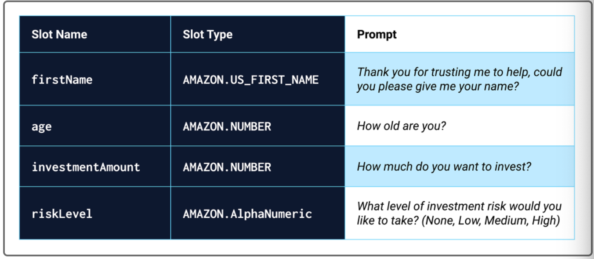

# RoboAdvisor_with_AWS_Lex_Lambda

Robotic Investment Advisor using Amazon AWS Lex and Lambda to get investment portfolio recommendations for retirement. This is achieved in three steps:

* Configure the initial robo advisor
* Build and test the robo advisor
* Enhance the robo advisor with an Amazon Lambda function

---

## Technologies

* [Amazon Lex](https://docs.aws.amazon.com/lex/latest/dg/what-is.html) - An AWS service for building conversational interfaces.

* [Lambda](https://docs.aws.amazon.com/lambda/?id=docs_gateway) - AWS Lambda is used to run code without provisioning or managing servers.

---

## Detailed Explanation

### Configure the initial robo advisor

1. A new custom Amazon Lex bot is created with certain criteria
    * Bot name: RoboAdvisor
    * Language: English (US)
    * Output voice: Salli
    * Session timeout: 5 minutes
    * Sentiment analysis: No
    * COPPA: No
    * Advanced options: No
    * All other options: The default value

2. A new intent named `recommendPortfolio` is added.

3. Sample utterances are configured as follows :
    * I want to save money for my retirement
    * I'm {age} and I would like to invest for my retirement
    * I'm ​{age} and I want to invest for my retirement
    * I want the best option to invest for my retirement
    * I'm worried about my retirement
    * I want to invest for my retirement
    * I would like to invest for my retirement

4. Four slots are created 

5. In the `Confirmation prompt` section set the following messages:
    * Confirm: Thanks, now I will look for the best investment portfolio for you.
    * Cancel: I will be pleased to assist you in the future.

### Build and test the robo advisor

Build and test the lex bot. The following is an exmaple conversation : 

### Enhance the robo advisor with an Amazon Lambda function

A Lambda Function is created to validate the data the suer supllies during a conversation with the robo advisor bot.

1. A Lambda Function named `recommendPortfolio` is created with Python 3.7 as the runtime programming language.

2. A `recommend_portfolio` function is added with validation for `age` and `investment_amount`.

3. The lambda function returns the following recommendation based on the selected risk level as follows:
    * None: “100% bonds (AGG), 0% equities (SPY)”
    * Low: “60% bonds (AGG), 40% equities (SPY)”
    * Medium: “40% bonds (AGG), 60% equities (SPY)”
    * High: “20% bonds (AGG), 80% equities (SPY)”

4. The lambda function is tested with test events in folder named `Test_Events`

5. The new Lmabda function is integrated into the bot by selecting `recommendPortfolio` in the `Lambda initialization and validation` and `Fulfillment` sections.

6. The bot is then  built and tested with  both valid and invalid data for the slots.

